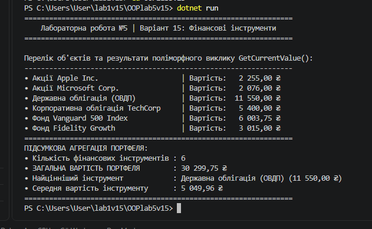

 Хід роботи

2. Проєктування ієрархії класів (Варіант 15):**
   - **`FinancialInstrument`** (базовий клас): містить властивість `Name` та віртуальний метод `GetCurrentValue()`.
   - **`Stock`** (акція): успадковує базовий клас, додає `TickerSymbol`, `SharePrice`, `NumShares`. Перевизначає `GetCurrentValue()` ($\text{ціна} \times \text{кількість}$).
   - **`Bond`** (облігація): успадковує базовий клас, додає `FaceValue`, `InterestRate`. Перевизначає `GetCurrentValue()` ($\text{номінал} + \text{відсоток}$).
   - **`MutualFund`** (пайовий фонд): успадковує базовий клас, додає `NAV`, `NumShares`. Перевизначає `GetCurrentValue()` ($\text{NAV} \times \text{кількість паїв}$).

3. Демонстрація поліморфізму та агрегація результатів:**
   - У класі `Program` створено колекцію об'єктів базового типу `List<FinancialInstrument>`, до якої додано екземпляри всіх похідних класів.
   - У циклі `foreach` продемонстровано динамічне зв'язування: для кожного об'єкта викликається відповідна перевизначена версія методу `GetCurrentValue()`.
   - Виконано агрегацію обчислених значень (загальна вартість портфеля, найцінніший інструмент та середня вартість).

4. Тестування та збереження:**
   - Програму успішно запущено, вивід результатів перевірено в консолі.
   - Проєкт завантажено до GitHub-репозиторію.

Що таке поліморфізм і як він реалізується в C# за допомогою virtual та override?   Поліморфізм — це здатність об'єктів різних похідних класів реагувати на однаковий виклик методу по-різному, залежно від їхнього фактичного типу під час виконання.   У C# базовий клас позначає метод модифікатором virtual, що дає дозвіл на його зміну. Похідні класи використовують модифікатор override, щоб надати власну специфічну реалізацію цього методу.   Поясніть поняття динамічного зв'язування. Чим воно відрізняється від статичного?   Динамічне зв'язування (Late Binding) — це процес, коли конкретна реалізація методу визначається безпосередньо під час виконання програми (in runtime) на основі фактичного типу об'єкта, а не типу змінної.   Відмінність: Статичне зв'язування (Early Binding) відбувається під час компіляції (наприклад, для звичайних невіртуальних методів або перевантажень), а динамічне — під час виконання програми для віртуальних методів.Наведіть приклад, як поліморфізм дозволяє писати більш гнучкий та розширюваний код.   Якщо знадобиться додати новий тип фінансового інструменту (наприклад, CryptoCurrency або RealEstate), достатньо створити новий клас, успадкований від FinancialInstrument, і реалізувати метод GetCurrentValue(). Основний код програми (обчислення загальної суми портфеля) не зазнає жодних змін і автоматично працюватиме з новим типом інструментів.Які переваги дає використання колекцій базових типів для роботи з поліморфними об'єктами?   Дозволяє зберігати в єдиній масивоподібній структурі (наприклад, List<FinancialInstrument>) об'єкти різних похідних класів.   Дає змогу обробляти всі об'єкти в єдиному циклі foreach без використання умовних операторів (if/switch) або ручного приведення типів (is/as).

