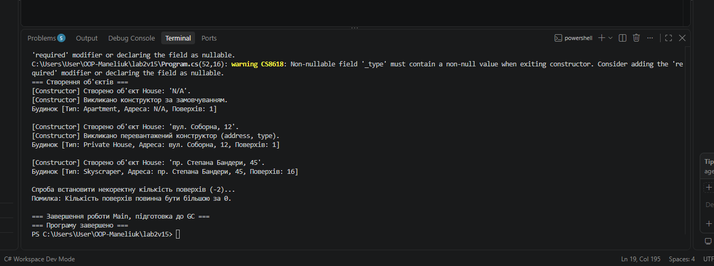

Перевантаження конструкторів (Constructor Overloading) — це оголошення в одному класі кількох конструкторів, які мають однакове ім'я (ім'я класу), але відрізняються сигнатурою (кількістю, типами або послідовністю параметрів).

Перевага: Надає гнучкість при створенні об'єктів. Розробник може ініціалізувати об'єкт різними способами залежно від наявних у нього даних (наприклад, задати всі параметри одразу, лише їх частину або створити об'єкт із значеннями за замовчуванням).

За допомогою синтаксису : this(...) реалізується ланцюговий виклик (делегування) конструкторів. Один конструктор може викликати інший конструктор того ж класу до виконання власного тіла коду.

Уникнення дублювання: Вся основна логіка ініціалізації та валідації полів зосереджується в одному "основному" (зазвичай найбільш параметризованому) конструкторі. Інші конструктори лише передають йому значення (або значення за замовчуванням) через : this(...), дотримуючись принципу DRY (Don't Repeat Yourself).

Деструктор (фіналізатор) у C# викликається Збирачем сміття (Garbage Collector, GC) у спеціальному фоновому потоці фіналізації (Finalizer Thread).

Момент виклику: Програміст не може викликати деструктор вручну або точно передбачити час його виклику (недетерміноване знищення). GC викликає деструктор тоді, коли виявляє, що на об'єкт у купі (heap) більше немає жодного активного посилання, і готує його до вилучення з пам'яті.

Викликувати GC.Collect() вручну в реальних програмах не рекомендується з таких причин:

Порушення автоматичної оптимізації: Garbage Collector у .NET оптимізований під роботу з поколіннями пам'яті (Gen 0, Gen 1, Gen 2) і сам визначає найефективніший момент для збирання на основі навантаження та доступної пам'яті.

Зниження продуктивності: Виклик GC.Collect() часто зупиняє виконання інших потоків програми (Stop-the-World pause) і вимагає значних ресурсів процесора для обходу всієї купи.

Передчасне просування об'єктів: Примусовий збір може необґрунтовано перевести тимчасові об'єкти в старші покоління (Gen 1 або Gen 2), де їх подальше видалення стає більш "коштовним" для системи.