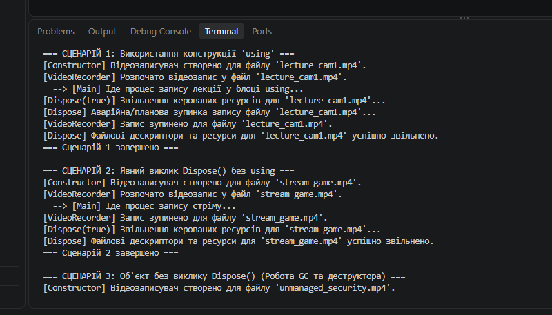
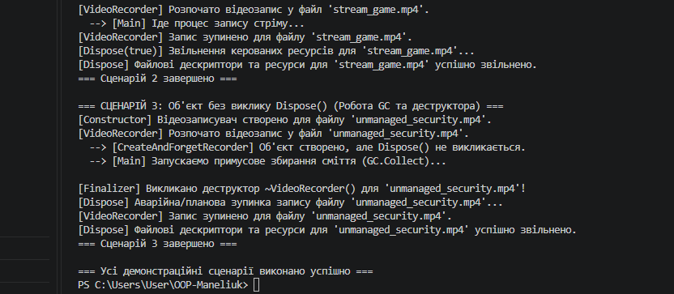

1. Що таке життєвий цикл об’єкта в .NET?
Це послідовність етапів існування об'єкта в пам'яті: створення (виділення пам'яті в купі та ініціалізація конструктором) $\rightarrow$ використання (виконання методів та доступ до властивостей) $\rightarrow$ втрата посилань $\rightarrow$ збирання сміття (виявлення об'єкта GC) $\rightarrow$ фіналізація (викликається деструктор, якщо є) $\rightarrow$ повне звільнення пам'яті.
2. Яка різниця між керованими та некерованими ресурсами?
* *Керовані ресурси (Managed resources):* Об'єкти, пам'ять під які виділяється середовищем CLR (масиви, екземпляри стандартних класів). Вони очищаються автоматично Збирачем сміття (GC).
* *Некеровані ресурси (Unmanaged resources):* Системні ресурси поза контролем CLR (дескриптори файлів, мережеві сокети, з'єднання з БД, вікна ОС). Вони вимагають явного закриття/звільнення програмістом.

3. Для чого призначений інтерфейс IDisposable?
Інтерфейс `IDisposable` реалізує єдиний метод `void Dispose()`. Він надає стандартний механізм для детермінованого (явного та негайного) звільнення некерованих (і керованих) ресурсів об'єкта, не чекаючи, поки спрацює автоматичний Garbage Collector.
4. Як оператор using допомагає в керуванні ресурсами?
Конструкція `using` створює синтаксичний цукор для блоку `try-finally`. Вона гарантує, що метод `Dispose()` буде викликаний для об'єкта при виході з блоку `using` за будь-яких умов, навіть якщо всередині виникне виняткова ситуація (exception).
5. Навіщо в патерні Dispose використовується метод GC.SuppressFinalize()?
Метод `GC.SuppressFinalize(this)` повідомляє Збирачу сміття, що об'єкт уже самстійно очистив свої ресурси через `Dispose()`, і його деструктор (фіналізатор) викликати **не потрібно**. Це прискорює видалення об'єкта з пам'яті та економить ресурси процесора.
6. Чому в деструкторі викликається Dispose(false), а в методі Dispose() — Dispose(true)?
* `Dispose(true)` (з явного `Dispose()`): Очищення викликане користувачем. Безпечно звільняти як **некеровані**, так і **керовані** ресурси, оскільки вони ще існують у пам'яті.
* `Dispose(false)` (з деструктора `~ClassName()`): Очищення викликано Збирачем сміття. Керовані об'єкти вже могли бути знищені GC, тому параметр `false` вказує звільняти **виключно некеровані ресурси**.

Хід роботи

1. Створення та налаштування проєкту:
* У робочій директорії `OOP-Maneliuk` за допомогою .NET CLI було створено новий консольний проєкт:

dotnet new console -o lab3v15

2. Реалізація класу `VideoRecorder` (Варіант 15):
* Створено клас `VideoRecorder`, що імітує роботу відеозаписувача та реалізує інтерфейс `IDisposable`.
* Додано приватні поля `_outputFile` (шлях до файлу), `_isRecording` (стан запису) та `_disposed` (прапорець повторного виклику очищення).
* Реалізовано методи `StartRecording()` і `StopRecording()` для керування станом об'єкта.
* Реалізовано стандартний **Dispose Pattern**:
* Захищений віртуальний метод `Dispose(bool disposing)` для розділення очищення керованих і некерованих ресурсів.
* Публічний метод `Dispose()` із викликом `GC.SuppressFinalize(this)`, який запобігає зайвому виклику фіналізатора.
* Деструктор `~VideoRecorder()`, який забезпечує аварійне звільнення ресурсів через `Dispose(false)`, якщо розробник забув викликати `Dispose()`.

3. Практична демонстрація в `Program.cs`:
 Сценарій 1 (Конструкція `using`): Продемонстровано детерміноване (негайне) звільнення ресурсів одразу після виходу з блоку видимості.
 Сценарій 2 (Явний виклик `Dispose()`):** Досліджено ручне закриття ресурсів без використання блоку `using`.
 Сценарій 3 (Робота Garbage Collector та деструктора):** Створено об'єкт без виклику `Dispose()`. За допомогою примусового виклику `GC.Collect()` і `GC.WaitForPendingFinalizers()` продемонстровано автоматичне спрацьовування деструктора у фоновому потоці.

4. Версіонування та завантаження на GitHub:
 Створено файл `.gitignore` для виключення системних папок `bin/` та `obj/`.
 Усунено проблеми з вкладеними репозиторіями Git.
 Проєкт закомічено та відправлено у віддалений репозиторій:
`[https://github.com/Dmytro1man/OOP-Maneliuk.git](https://github.com/Dmytro1man/OOP-Maneliuk.git)`

