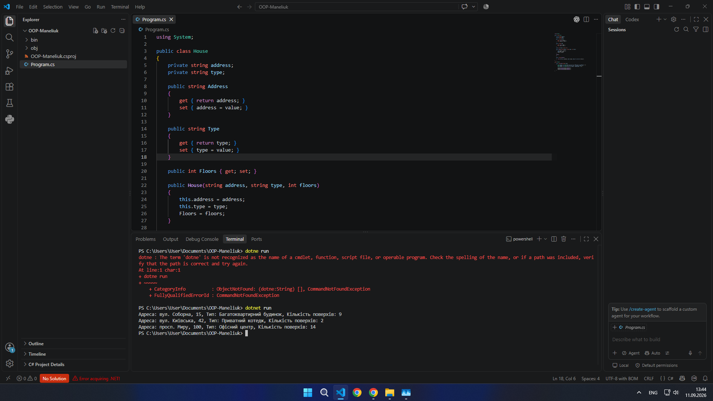

                                                       Контрольні запитання
1 Клас та об’єкт

Клас — це абстрактний шаблон (креслення або тип даних), що визначає структуру (поля) та поведінку (методи) майбутніх об’єктів. Сам по собі клас не займає оперативної пам'яті під дані.

Об’єкт — це конкретний екземпляр класу, створений у пам'яті за допомогою оператора new, який має власні реальні значення даних.

Різниця: Клас — це лише схема чи проєкт (наприклад, креслення будинку House), а об’єкт — це реальний збудований будинок у пам'яті.

2  Конструктори та їх необхідність

Призначення: Конструктор — це спеціальний метод класу, який автоматично викликається під час створення нового об'єкта (new ClassName()) для початкового налаштування його стану (заповнення полів).

Чи може існувати без нього: Так. Якщо в коді не оголошено жодного конструктора, компілятор C# автоматично створює прихований конструктор за замовчуванням (без параметрів), який ініціалізує всі поля значеннями за замовчуванням (null, 0, false).

3  Приватні поля, публічні властивості та інкапсуляція

Приватне поле (private): Змінна, що зберігає дані всередині об'єкта і доступна тільки з середини самого класу.

Публічна властивість (public): Метод-обгортка із блоками get та set, який надає безпечний доступ до приватного поля ззовні.

Навіщо потрібна інкапсуляція: Це принцип ООП, що приховує внутрішню реалізацію об'єкта й захищає його дані від некоректного чи несанкціонованого прямого втручання ззовні (наприклад, дозволяє додати перевірку на від'ємну кількість поверхів у властивості перед записом у поле).

